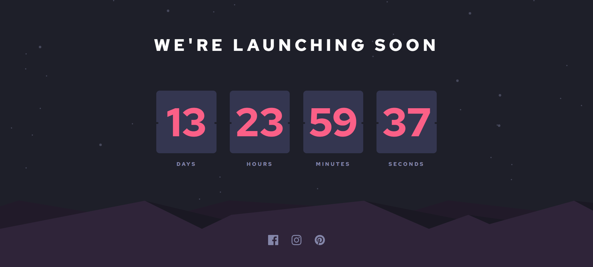

# Frontend Mentor - Launch countdown timer solution

This is a solution to the [Launch countdown timer challenge on Frontend Mentor](https://www.frontendmentor.io/challenges/launch-countdown-timer-N0XkGfyz-). Frontend Mentor challenges help you improve your coding skills by building realistic projects. 

## Table of contents

- [Overview](#overview)
  - [The challenge](#the-challenge)
  - [Screenshot](#screenshot)
  - [Links](#links)
- [My process](#my-process)
  - [Built with](#built-with)
  - [What I learned](#what-i-learned)
  - [Continued development](#continued-development)
- [Author](#author)

## Overview

### The challenge

Users should be able to:

- See hover states for all interactive elements on the page
- See a live countdown timer that ticks down every second (start the count at 14 days)
- **Bonus**: When a number changes, make the card flip from the middle

### Screenshot

### Links

- Solution URL: [Github repo](https://github.com/Robertron624/blogr-landing-page)
- Live Site URL: [Netlify Live URL](https://main--cheerful-hotteok-3a30c6.netlify.app/)

## My process

### Built with

- Semantic HTML5 markup
- CSS custom properties
- Flexbox
- Mobile-first workflow
- [Svelte](https://svelte.dev/) - JS library
- [Sass](https://sass-lang.com/) - For styles

### What I learned

With this project I learned a lot of Dates and how to manipulate them in JavaScript. I also learned how to use Svelte and how to use it with Sass, it was really easy to use and I really liked it, I think Svelte is a great and easier alternative to React and Vue.

### Continued development

I want to keep testing my skills with Svelte and Sass, I think they are great tools and I want to keep learning them. I also want to keep learning more about JavaScript and how to manipulate dates and times. After working with Svelte I want to try other frameworks like Angular and Solid.

## Author

- Personal Website - [Robert Ramirez](https://robert-ramirez.netlify.app)
- Frontend Mentor User- [@Robertron624](https://www.frontendmentor.io/profile/Robertron624)
- Twitter - [@robertdowny](https://www.twitter.com/robertdowny)
